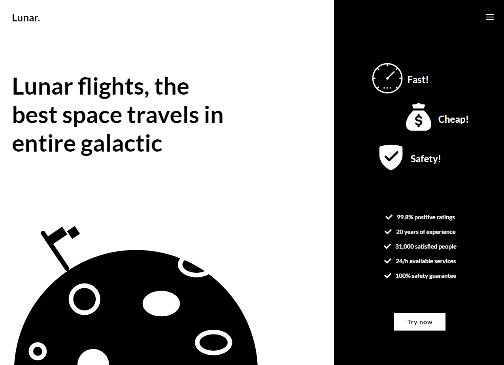

# Lunar
> A fully-responsive website about travelling into the space

## Table of contents
* [General info](#general-info)
* [Screenshots](#screenshots)
* [Technologies](#technologies)
* [Setup](#setup)
* [Status](#status)
* [Inspiration](#inspiration)
* [Contact](#contact)

## General info
This is my first bigger project, where I designed, coded and developed everything by myself

## Screenshots


## Technologies
* HTML5, CSS3, JavaScript(ES6)
* Sass - version 1.19.0
* Webpack - version 4.30.0
* Image-min-cli - version 4.0.1

## Setup
Setup of the project
* Clone this repo
* ```npm -i```

Working with the project
* npm run build - builds everything
* npm run build:sass - builds styles
* npm run watch:sass - watches for changes in styles
* npm run build:webpack - builds JavaScript
* npm run watch:webpack - watches for changes in JavaScript

## Status
Project is: _finished_

## Contact
Created by [@jKondraciuk](https://jkondraciuk.github.io) - feel free to contact me!
